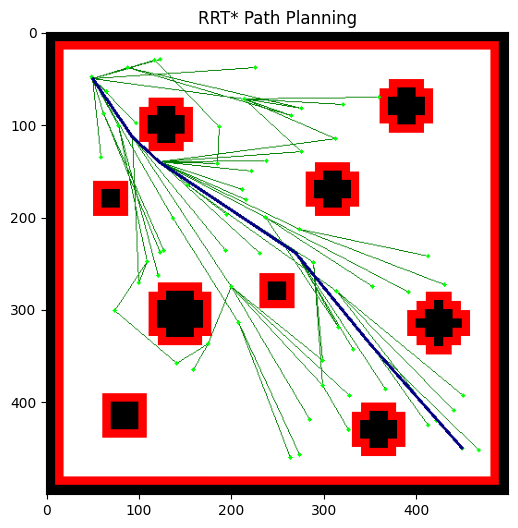

# Path Planning Demos

Small collection of vision-based path planning demos.  
The notebook builds an occupancy map from an input image, runs a search-based planner to find a collision-free path from start to goal, and visualises the result.



---

## Features

- Loads and processes a map image using OpenCV.
- Builds a grid / occupancy representation for planning.
- Runs a search-based path planner to compute a path.
- Visualises explored nodes and the final path with Matplotlib.
- All logic contained in a single Jupyter notebook for easy experimentation.

---

## Repository Structure

- `visionPathPlanning.ipynb` – main notebook with all path-planning code and visualisations.
- `requirements.txt` – Python dependencies for running the notebook.

---

## Setup

1. Clone the repository:

```bash
git clone https://github.com/darshan-k-s/Path-Planning-Demos.git
cd Path-Planning-Demos
```

2. Create and activate a virtual environment. Install dependencies:
```bash
pip install -r requirements.txt
```

---

## Usage
1. Launch Jupyter:
```bash
jupyter notebook
```
2. Open `visionPathPlanning.ipynb`.
3. Step through the cells in order:
   - Adjust the system parameters at the top of the notebook if needed.
   - Run the planning cells to generate a path.
   - View the visualisations of the map, explored space and final path.

